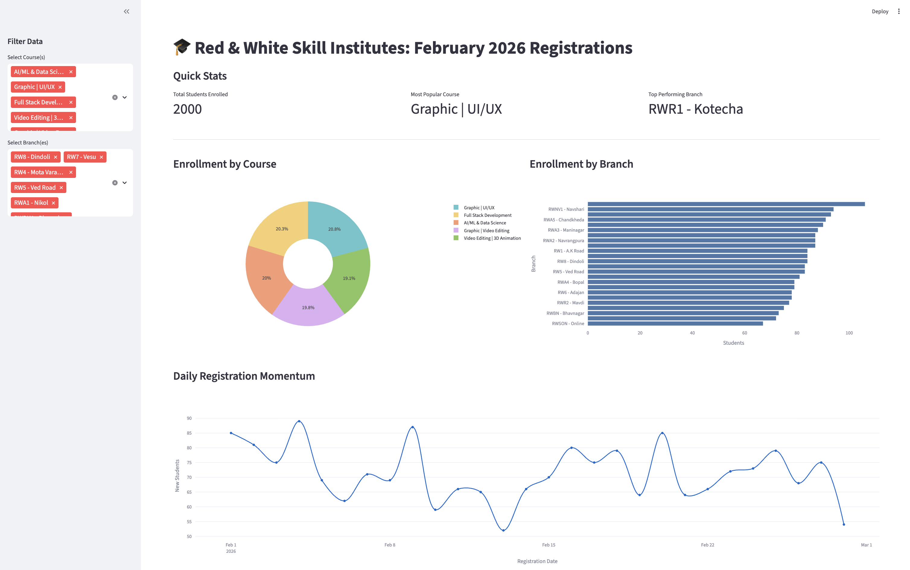
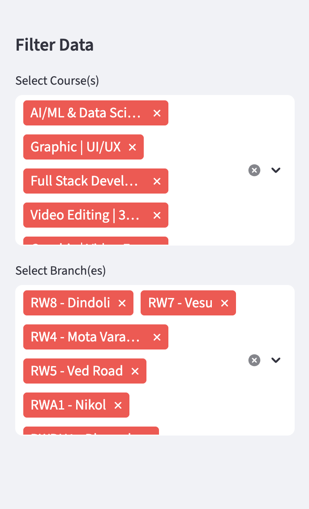
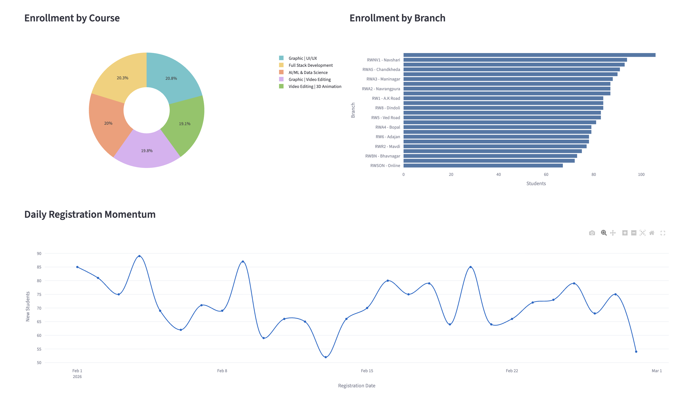
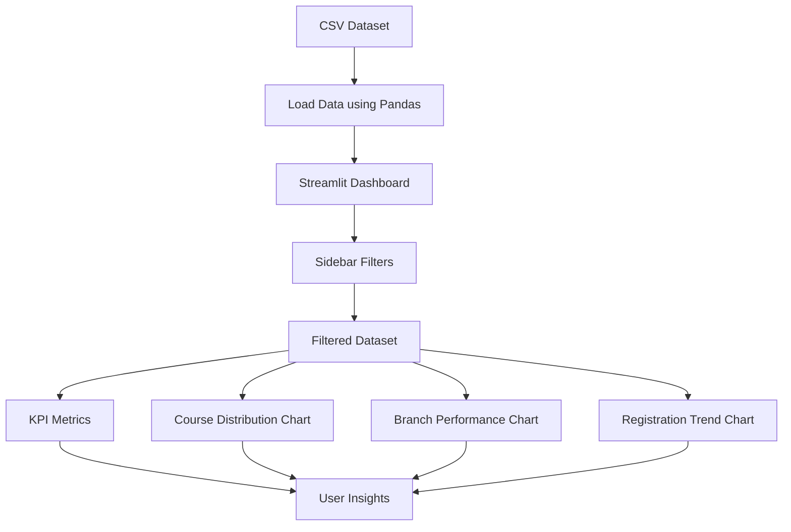

# 📊 RNW Dashboard


------------------------------------------------------------------------

# 🚀 Project Overview

**RNW Dashboard** is an interactive **Python-based data visualization
dashboard** built using **Streamlit**.\
It analyzes and visualizes **student registration data** to provide
quick insights into enrollment trends.

The project demonstrates how Python can be used to build **lightweight
analytical dashboards** with minimal setup while still delivering
powerful data insights.

### 🎯 Why This Project Was Built

This project was developed as a **portfolio demonstration** to showcase:

-   Python modular programming
-   Streamlit dashboard development
-   Data filtering and interactive UI
-   Data visualization using Plotly
-   Real-world style analytics dashboard

------------------------------------------------------------------------

# 🖥️ Demo

### Dashboard Overview



### Data Filtering

<!--  -->


### Data Visualization



------------------------------------------------------------------------

# ✨ Features

  -----------------------------------------------------------------------
  Module                 Description
  ---------------------- ------------------------------------------------
  Python                 Core programming language used for data
                         processing and application logic

  Streamlit              Used to build the interactive web-based
                         dashboard UI

  Pandas                 Handles dataset loading, filtering, grouping,
                         and analysis

  Plotly                 Creates interactive charts for data
                         visualization

  Sidebar Filters        Allows filtering by course and branch

  KPI Metrics            Displays key statistics like total students and
                         popular courses
  -----------------------------------------------------------------------

------------------------------------------------------------------------

# 🧠 Skills Demonstrated

-   Python Data Analysis
-   Dashboard Development
-   Data Visualization
-   Interactive UI Development
-   Modular Programming
-   Data Filtering & Transformation
-   Real-world Analytics Problem Solving
-   Streamlit Application Development

------------------------------------------------------------------------

# 🧰 Technologies Used

  Technology       Purpose
  ---------------- ----------------------------------
  Python 3         Core programming language
  Streamlit        Dashboard framework
  Pandas           Data manipulation
  Plotly Express   Interactive visualizations
  CSV Dataset      Sample student registration data

------------------------------------------------------------------------

# 🏗️ Program Architecture



------------------------------------------------------------------------

# 📁 Project Structure

    RNW-Dashboard
    │
    ├── dashboard.py
    ├── student_dummy_data.csv
    │
    ├── images
    │   ├── dashboard_overview.png
    │   ├── dashboard_filters.png
    │   └── dashboard_charts.png
    │
    └── README.md

------------------------------------------------------------------------

# 🔍 Application Walkthrough

## 📥 Data Loading (Python)

The application loads student registration data from a **CSV file**
using Pandas.

``` python
df = pd.read_csv("student_dummy_data.csv")
df['Registration Date'] = pd.to_datetime(df['Registration Date'])
```

------------------------------------------------------------------------

## 🎛️ Dashboard Interface (Streamlit)

Streamlit powers the dashboard interface including:

-   Sidebar filters
-   KPI metrics
-   Chart visualization
-   Responsive layout

------------------------------------------------------------------------

# ▶️ How to Run the Project

### 1️⃣ Clone the Repository

``` bash
git clone https://github.com/yourusername/rnw-dashboard.git
```

### 2️⃣ Navigate to Project Folder

``` bash
cd rnw-dashboard
```

### 3️⃣ Install Dependencies

``` bash
pip install streamlit pandas plotly
```

### 4️⃣ Run the Dashboard

``` bash
streamlit run dashboard.py
```

------------------------------------------------------------------------

# 💼 Portfolio Value

This project demonstrates the ability to build **real-world analytics
dashboards** using Python.

A recruiter reviewing this project will see skills in:

-   Python programming
-   Data analytics
-   Visualization
-   Dashboard development
-   Practical data storytelling

------------------------------------------------------------------------

# 🔮 Future Improvements

-   Add advanced visualizations
-   Deploy to Streamlit Cloud
-   Connect to live database
-   Add authentication system
-   Improve mobile responsiveness

------------------------------------------------------------------------

# 👨‍💻 Author

**Milan Kathiriya**

Educator \| Data Science Mentor \| Technology Enthusiast

> "Data becomes powerful when it tells a story. Build tools that turn
> numbers into decisions."
